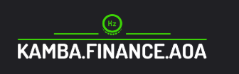
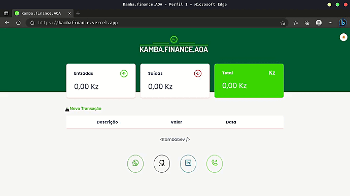
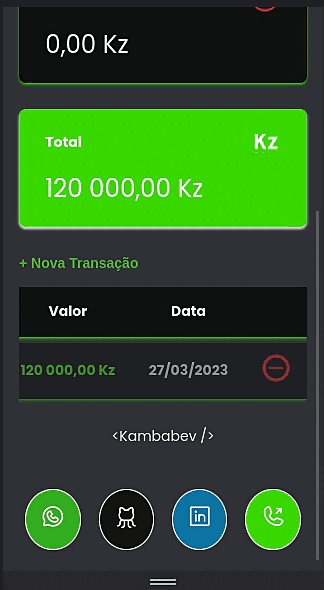

 <h1 align="center" height="150px" back-ground="black">
 
 </h1>

## Índice  

- [📜 Sobre ](#📜-sobre)

- [🚀 Tecnologias](#🚀-tecnologias)

   
---
<h2 align="center"> <a href="(https://kambafinance.vercel.app">Demostração do projeto kamba.finance.AOA  </a> </h2>  
 

 

   

 
 

---
## 📜  Sobre

 Uma **aplicação de controle de stock**, desenvolvido durante da [maratona discover 1](https://www.youtube.com/watch?v=NlDr6JX3VvA&list=PLeLKux5eT3kY2mvZUi7IM5T548vfKxGq5),  a versão da maratona é dev.finance$, veja o layout do projeto no figma clicando [aqui](). 

 Veja a kambafinance a funcionar online clicando [aqui](https://kambafinance.vercel.app).
 
---
  ## 🚀 Tecnologias 
   

   

 

  

  

    